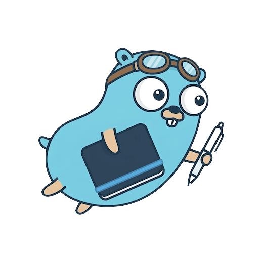
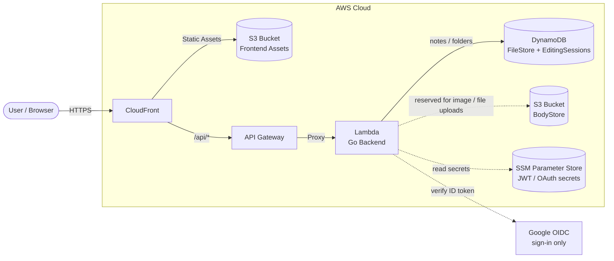

<p align="center">
  
  <br>
  <sub>The Go Gopher was designed by <a href="https://reneefrench.blogspot.com/">Renée French</a>, licensed under <a href="https://creativecommons.org/licenses/by/4.0/">CC BY 4.0</a>.</sub>
</p>

# GophDrive

GophDrive is a serverless Markdown note-taking application designed for AWS. Notes are stored in DynamoDB inside your own AWS account, with point-in-time recovery and a one-click ZIP export. Google is used purely as an OIDC identity provider — no Drive scope, no third-party data access.
Built with extensibility in mind, GophDrive uses a clean adapter pattern that leaves room for future storage backends.

## Live Demo

You can experience GophDrive's interface and functionality using the demo mode at:
**[https://gophdrive.n-s.tokyo/](https://gophdrive.n-s.tokyo/)**

> [!IMPORTANT]
> Since GophDrive is designed to be self-hosted, the **"Login with Google" feature is disabled** on the demo site. Please use the **"Try Demo Mode"** button to explore the application using ephemeral storage.

## Key Features

- **Self-hosted Storage**: Notes live in a DynamoDB table inside your own AWS account. Point-in-time recovery is enabled (35-day any-second restore) and `RemovalPolicy.RETAIN` protects against accidental teardown.
- **One-click ZIP Export**: Download every note as a ZIP archive that mirrors your folder hierarchy — see Settings.
- **Serverless Architecture**: Built on AWS Lambda, API Gateway, DynamoDB, S3, and CloudFront for high availability, automatic scaling, and low cost.
- **Client-Side Processing (WebAssembly)**: Core logic, including Markdown processing and conflict resolution, is written in Go and compiled to WebAssembly (Wasm) for fast, secure execution directly in your browser.
- **Real-Time Conflict Management**: Session-based locking ensures that concurrent edits don't result in data loss.
- **Demo Mode**: Try out the application functionality without setting up Google OAuth — demo data is auto-cleaned after 60 minutes via DynamoDB TTL.
- **Custom Domains**: Easily map your own domain name (with TLS 1.3 enforcement) via the automated AWS CDK deployment scripts.

## Tech Stack

- **Frontend**: Next.js (App Router), React, TypeScript, CSS Modules
- **Backend (API)**: Go (standard library/AWS Lambda Go), compiled for `provided.al2023` ARM64 Lambda
- **Shared Core**: Go (compiled to WebAssembly)
- **Infrastructure**: AWS CDK (TypeScript). Local dev runs natively on the host with DynamoDB Local in Docker
- **Database**: Amazon DynamoDB (notes/folders + edit-session locks)
- **Auth**: Google OIDC (sign-in only) + self-issued HS256 JWT sessions

## Architecture



## Project Structure

```text
GophDrive/
├── backend/            # Go Backend API (AWS Lambda handlers & business logic)
├── core/               # Shared Go logic (compiled to Wasm for the frontend)
├── frontend/           # Next.js SPA Frontend
├── infra/              # Infrastructure as Code (AWS CDK definitions)
├── scripts/            # Automation scripts for local dev and AWS deployment
├── Procfile            # overmind process map (backend / frontend / wasm watcher)
└── docker-compose.yml  # DynamoDB Local only — everything else runs on the host
```

## Getting Started

### Prerequisites

- [mise](https://mise.jdx.dev/) — toolchain manager (reads `.tool-versions` for Go and Node)
- [overmind](https://github.com/DarthSim/overmind) — Procfile-based process supervisor (`brew install overmind`)
- [Docker](https://www.docker.com/) — only used to run DynamoDB Local
- [AWS CLI](https://aws.amazon.com/cli/) — used by `setup.sh` to create local DynamoDB tables, and for AWS deployment
- [AWS CDK CLI](https://docs.aws.amazon.com/cdk/v2/guide/cli.html) (`npm install -g aws-cdk`) — for AWS deployment

### Local Development

1. **First-time setup**:
   ```bash
   ./scripts/setup.sh
   ```
   Installs Go/Node via mise, runs `npm ci` for `frontend/` and `infra/`, starts DynamoDB Local in Docker, creates the two DynamoDB tables (`FileStore`, `EditingSessions`), builds an initial `core.wasm`, and copies `.env.example` to `.env`.

2. **Boot the dev stack**:
   ```bash
   ./scripts/dev.sh        # equivalent to: docker compose up -d dynamodb-local && overmind start
   ```
   `overmind` runs three processes from the root `Procfile`:
   - `backend`  — Go API on `:8080` (Air hot reload, `cmd/server/main.go` HTTP wrapper)
   - `frontend` — Next.js on `:3000` (`npm run dev`, native FS watch)
   - `wasm`     — Air watcher recompiling `core/` to `frontend/public/core.wasm` on change

3. **Access the Application**: [http://localhost:3000](http://localhost:3000)

Useful overmind commands:

```bash
overmind connect backend   # tail one process and Ctrl-c to restart
overmind restart frontend  # restart a single process from another shell
overmind kill              # stop everything
```

- *Note: If `core/` changes, the Wasm watcher auto-rebuilds. To regenerate manually run `./scripts/internal/build-wasm.sh`.*
- *To exercise the live Google OAuth flow on localhost (instead of Demo login), see [`docs/local-google-oauth.md`](docs/local-google-oauth.md).*

## Deployment (AWS Production)

GophDrive includes an automated script for deploying the entire stack to your AWS account.

### 1. Configure Google OAuth
Before deploying, create a Google Cloud Project and configure OAuth 2.0 credentials:
- Go to the [Google Cloud Console](https://console.cloud.google.com).
- Create a project and navigate to **APIs & Services > Credentials**.
- Create an **OAuth client ID** (Web application). Required scopes: `openid`, `email`, `profile` only — no Drive scope is needed.
- Set the Authorized Redirect URI to your intended domain's `/api/auth/callback` path (e.g., `https://gophdrive.example.com/api/auth/callback` or the CloudFront URL after deployment).
- For an equivalent setup against `localhost`, see [`docs/local-google-oauth.md`](docs/local-google-oauth.md).

### 2. AWS CDK Bootstrap (First Time Only)
If this is your first time deploying AWS CDK to this region/account, you must bootstrap it:
```bash
cd infra
npx cdk bootstrap
cd ..
```

### 3. Run the Deployment Script
Set your credentials as environment variables and run the script:

```bash
export GOOGLE_CLIENT_ID="your-google-client-id"
export GOOGLE_CLIENT_SECRET="your-google-client-secret"

# Optional: To use a custom domain name
export CUSTOM_DOMAIN_NAME="gophdrive.your-domain.com"
export CERTIFICATE_ARN="arn:aws:acm:us-east-1:123456789012:certificate/uuid"

# Optional: Privacy Policy and Terms of Service (required for Google OAuth production approval)
export PRIVACY_POLICY_URL="/privacy"
export TERMS_OF_SERVICE_URL="/terms"

./scripts/deploy-aws.sh
```

The script will automatically:
1. Manage secure secrets via AWS Systems Manager Parameter Store.
2. Build the Go Lambda backend.
3. Deploy the backend and database infrastructure via AWS CDK.
4. Extract the generated `FRONTEND_URL`.
5. Build the Next.js static frontend using the correct URL context.
6. Deploy the frontend assets to the S3 Bucket and invalidate the CloudFront cache.

### 4. Privacy Policy & Terms of Service

Google OAuth production approval requires a privacy policy and terms of service URL. Since GophDrive is a self-hosted application, **you** are responsible for providing these documents.

Template documents are available in [`docs/`](docs/) to help you get started:
- [`PRIVACY_POLICY_TEMPLATE.md`](docs/PRIVACY_POLICY_TEMPLATE.md)
- [`TERMS_OF_SERVICE_TEMPLATE.md`](docs/TERMS_OF_SERVICE_TEMPLATE.md)

Set the `PRIVACY_POLICY_URL` and `TERMS_OF_SERVICE_URL` environment variables during deployment to display links in the application footer.

## Operations

- **Backup & restore**: DynamoDB PITR is enabled on `FileStore` (35-day any-second restore). The Settings page also offers a one-click ZIP export of every note. Procedures for both paths live in [`docs/disaster-recovery.md`](docs/disaster-recovery.md).
- **Local OAuth verification**: To exercise the live Google sign-in flow on localhost (instead of relying on Demo login), follow [`docs/local-google-oauth.md`](docs/local-google-oauth.md).
